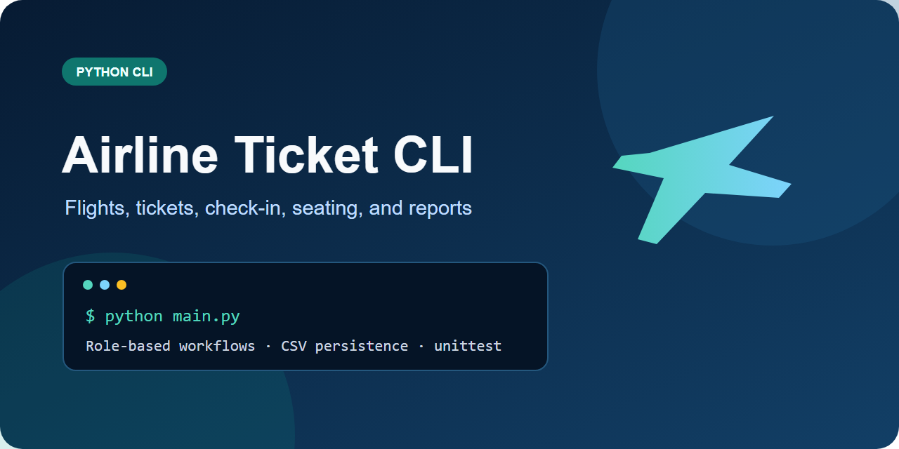

# Airline Ticket CLI

A dependency-free Python command-line application for exploring flights, managing airline tickets, checking in passengers, assigning seats, and producing operational reports.



## Overview

Airline Ticket CLI demonstrates a complete file-backed reservation workflow without a database or external service. It is intended for students, Python learners, and developers interested in a compact example of role-based CLI design and CSV persistence.

The application supports three roles:

- Customers can search flights, compare fares, buy tickets, review upcoming trips, and check in.
- Sellers can sell, edit, search, and delete tickets, as well as check in passengers.
- Managers can register sellers, manage flights and ticket deletions, and generate sales reports.

## Key Features

- Single-criterion and incremental multi-criteria flight search
- Flexible departure and arrival date ranges
- Cheapest-flight comparison
- Ticket purchasing for account holders and travel companions
- Capacity tracking and seat-map assignment
- Customer and seller check-in workflows
- Role-based menus for customers, sellers, and managers
- CSV-backed persistence with no runtime dependencies
- Synthetic demonstration data suitable for a public repository

## Technical Highlights

- Feature modules separate authentication, flight search, booking, check-in, sales, management, validation, and storage.
- Shared in-memory collections are loaded idempotently from pipe-delimited CSV files.
- Data paths resolve from the project location, so the CLI works from any current working directory.
- Seat availability uses a dedicated inventory record containing aircraft model, capacity, and remaining seats.
- Existing scheduled-flight and ticket relationships are represented by stable identifiers rather than duplicated flight details.

## Technology Stack

- Python 3.10+
- Python standard library (`csv`, `datetime`, and `pathlib`)
- `unittest` for automated tests
- CSV and text files for local persistence

## Architecture

```text
airline/
├── api.py          # Stable application facade
├── auth.py         # Authentication and registration
├── booking.py      # Customer ticket purchasing
├── checkin.py      # Customer check-in and seat assignment
├── cli.py          # Menus and application routing
├── flights.py      # Flight discovery and filtering
├── management.py   # Manager workflows and reporting
├── paths.py        # Project-relative data paths
├── sales.py        # Seller ticket workflows
├── state.py        # Shared in-memory collections
├── storage.py      # CSV loading
└── validation.py   # Interactive input validation
```

Runtime data lives in `data/`, while focused module and storage checks live in `tests/`.

## Getting Started

### Prerequisites

- Python 3.10 or newer

No third-party runtime package is required.

### Run from source

```bash
python main.py
```

### Install the console command

```bash
python -m pip install -e .
airline-tickets
```

### Run the tests

```bash
python -m unittest discover -s tests -v
```

## Demo Accounts

All bundled accounts are synthetic and use reserved `example.com` addresses.

| Role | Username | Password |
| --- | --- | --- |
| Customer | `demo_customer` | `Customer1` |
| Seller | `demo_seller` | `Seller123` |
| Manager | `demo_manager` | `Manager1` |

These credentials exist only to demonstrate the role-based workflows. This application stores credentials in CSV files and must not be used as a production authentication system.

## Data Model

The application keeps separate datasets for recurring flights, dated scheduled flights, aircraft models, airports, users, tickets, seat inventory, guest passengers, and occupied seats. Records are joined by flight number, scheduled-flight ID, and ticket number.

## Known Limitations

- CSV writes are not transactional and do not support concurrent users.
- Passwords are stored as plain-text demo values.
- The interface is interactive and does not expose a web API or graphical UI.
- The current tests cover module boundaries, data loading, and core validation helpers rather than every interactive menu path.

## Contributing

See [CONTRIBUTING.md](CONTRIBUTING.md) for the development and verification workflow.

## Security

This is an educational local application, not a production reservation platform. Review [SECURITY.md](SECURITY.md) before using different data or reporting a vulnerability.

## License

No license has been granted yet. Redistribution terms should be confirmed by the repository owner before adding a license.
